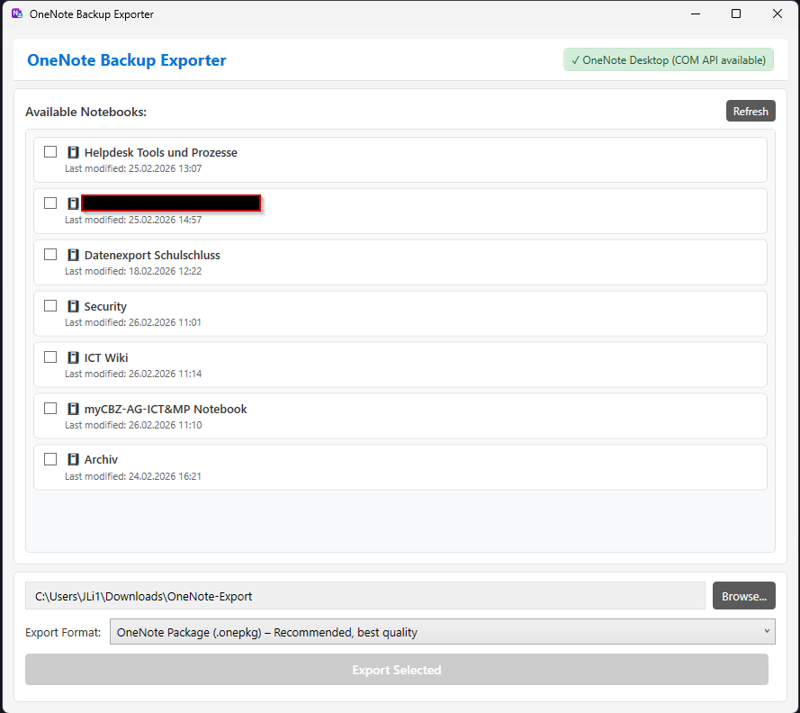
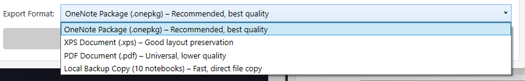

# OneNote Backup Exporter

A Windows desktop application to export OneNote notebooks to portable formats. It talks directly to OneNote Desktop via the COM API — no cloud services, no account required, no internet connection.

## Download

Go to [Releases](../../releases/latest) and download `OneNoteBackupExporter_Setup_1.0.0.exe`. Run the installer, done.

## Requirements

- Windows 10 or 11 (64-bit)
- OneNote Desktop 2016 or later (including Microsoft 365)

The Microsoft Store version of OneNote is not supported.

## Export Formats

| Format | Notes |
|---|---|
| OneNote Package (.onepkg) | Recommended. Full-fidelity, re-importable into OneNote. |
| XPS Document (.xps) | Good layout preservation. |
| PDF Document (.pdf) | Universal, slightly lower quality on complex pages. |
| Local Backup Copy | Copies the raw backup folder from `%LOCALAPPDATA%\Microsoft\OneNote\16.0\Sicherung`. Fastest option, all notebooks at once. |

## Notes

- Password-protected sections cannot be exported. Unlock them in OneNote first.
- Cloud notebooks (OneDrive, SharePoint) must be synced before export. Large notebooks can take several minutes.
- If PDF or XPS export times out on a large notebook, use the OneNote Package format instead.
