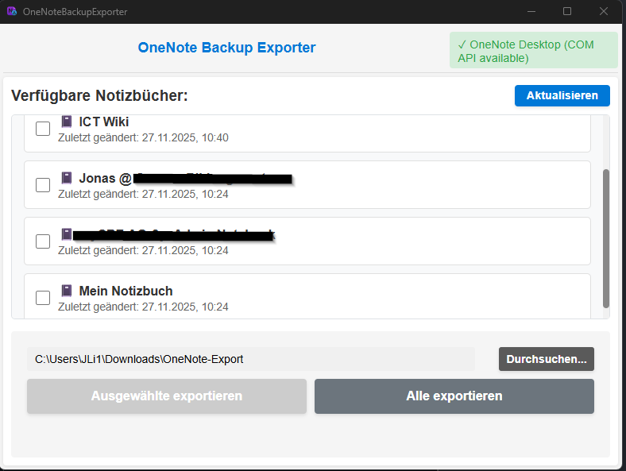

# OneNote Backup Exporter

A desktop application for exporting Microsoft OneNote notebooks in multiple formats (OneNote Package, XPS, PDF) via the OneNote COM API.

## Features

- ✅ Direct export from OneNote Desktop via COM API
- ✅ **Multi-format export:** OneNote Package (.onepkg), XPS Document (.xps), PDF Document (.pdf)
- ✅ Export individual notebooks or all at once
- ✅ Full synchronization before export
- ✅ Progress tracking and detailed status messages
- ✅ Modern, user-friendly interface
- ✅ Works with MyLMS, Class Notebooks (SharePoint)

## Requirements

### Runtime
- Windows 10/11
- OneNote Desktop 2016 or 365 ("OneNote for Windows")

**Important:** The app only works with OneNote Desktop (2016 or 365), not with the UWP app (Windows 10 OneNote) or OneNote for Web/Mac.

## Installation

1. Download the latest `OneNoteBackupExporter_Setup_x64.exe` from [Releases](https://github.com/vikingjunior12/OneNoteBackupExporter/releases/latest)
2. Run the setup.exe
3. Follow the installation wizard

## Usage

1. Start the application
2. The app automatically detects OneNote Desktop and lists all notebooks
3. Select notebooks (individually or all)
4. Choose your preferred export format (OneNote Package, XPS, or PDF)
5. Choose or customize the destination folder
6. Click "Export Selected" or "Export All"
7. The export folder opens automatically after successful export

## Architecture

The application uses a hybrid architecture:

- **Frontend:** JavaScript/Vite (UI)
- **Backend:** Go/Wails (Application logic)
- **COM Helper:** C# (OneNote integration)

The C# Helper communicates via JSON-RPC (stdin/stdout) with the Go backend, which in turn is connected to the JavaScript frontend via Wails bindings.

## Known Limitations

- Password-protected sections are skipped
- Very large notebooks (>500MB) may cause timeouts
- PDF export may not preserve all OneNote formatting perfectly for complex page layouts
- Requires OneNote Desktop (not the UWP version)
- Windows-only

## Troubleshooting

### Export fails
- Check write permissions in the destination folder
- Ensure sufficient disk space is available
- Fully synchronize notebooks in the OneNote app beforehand (SharePoint, OneDrive)

## License

This project is licensed under the MIT License - see [LICENSE](LICENSE) for details.

Copyright © 2025 JLI Software
